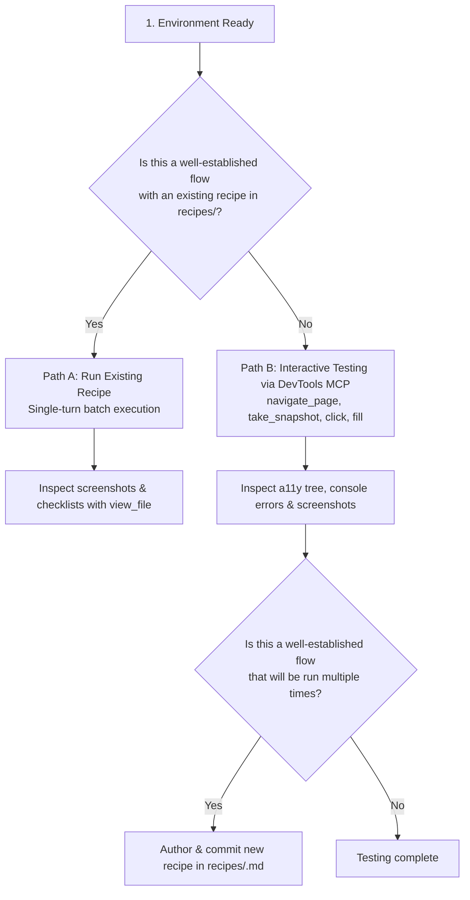

# Manual Testing Skill

This skill guides the agent through setting up the local environment and running browser-based testing for Fleet Console UI pages in Chrome using a two-tier approach:
- **Automated Recipes**: For fast, repeatable single-turn execution of well-established user flows.
- **Chrome DevTools MCP**: For step-by-step interactive testing, exploratory verification of new or ad-hoc UI changes, and diagnosing runtime errors.

---

## 1. Environment Setup

### A. Browser & Frontend (Always Required)

1. **Chrome Remote Debugging (`port 9222`)**:
   - Check if Chrome is listening on port 9222: `curl -s http://127.0.0.1:9222/json/version`
   - If not running, launch headless Chrome in the background:
     ```bash
     google-chrome --headless=new --remote-debugging-port=9222 --user-data-dir="/tmp/chrome-fleet-profile" --remote-allow-origins="*" --no-sandbox &
     ```

2. **Configure Frontend Environment (`milo/ui/.env.development.local`)**:
   - Ensure `.env.development.local` exists in `milo/ui/` configured with the appropriate backend host:
     - **When running against local backend**:
       ```env
       VITE_OVERRIDE_FLEET_CONSOLE_HOST=localhost:8800
       ```
     - **When running against dev backend** (no local backend needed):
       Ensure `.env.development.local` points to the dev backend endpoint or omits local overrides.

3. **Start Vite Development Server (`port 8080` in `milo/ui/`)**:
   - Start the Vite development server as a background daemon:
     ```bash
     npm run dev
     ```
   - Verify it is listening: `curl -s http://localhost:8080/ui`

### B. Backend & Database Setup (Only If Local Changes Were Made)

> [!NOTE]
> **When is this needed?** Starting the local backend and PostgreSQL database is **only required if your changes include modifications to backend Go RPCs/handlers or Ent database schemas/migrations that are not yet deployed in the dev environment**. For pure UI changes, frontend unit tests and running against dev services are sufficient.

If fullstack local services are needed:
1. **PostgreSQL Database (`port 5432` in `infra/infra` -> `go/src/infra/fleetconsole`)**:
   ```bash
   make run-db
   ```
2. **Local Backend Server (`port 8800` in `infra/infra` -> `go/src/infra/fleetconsole`)**:
   ```bash
   make run-local-db
   ```
   - Verify it is listening: `curl -s http://127.0.0.1:8800/prpc/fleetconsole.FleetConsole/Ping`

---

## 2. Testing Workflow



---

## 3. Path A: Running Existing Recipes (Automated)

If the user journey already has a matching document in `recipes/` (e.g. [`priority_scoring_rules.md`](./recipes/priority_scoring_rules.md)):

1. Read the recipe file to review its target URL, action steps, and visual checklist.
2. Execute the embedded JSON action sequence via `gbrowser batch`:
   ```bash
   GBROWSER=/google/bin/releases/gemini-agents-gbrowser/gbrowser
   $GBROWSER batch --debug-port=9222 - << 'JSON_EOF'
   [
     {"action": "navigate", "url": "http://localhost:8080/ui/fleet/", "waitUntil": "none"},
     {"action": "sleep", "duration": "2s"},
     {"action": "click", "selector": "a:has-text('View all devices'), [data-testid='view-all-chromeos-devices']"},
     {"action": "screenshot", "file": "/tmp/chromeos_devices.png"}
   ]
   JSON_EOF
   ```
3. Inspect screenshot output using `view_file` and compare the rendered UI state against the recipe's **Visual Verification Checklist**.

---

## 4. Path B: Interactive Testing & Exploration via DevTools MCP

When verifying **new UI features**, testing **un-scripted edge cases**, or **troubleshooting a failed recipe step**, use the `chrome_devtools` MCP tools directly:

### Fleet Console Specific Guidance
- **FilterBar Interactions**: Filter chips in Fleet Console `<FilterBar />` require pressing `Enter` (or selecting from dropdown suggestions) to commit the chip value before applying or submitting filters.
- **URL Parameter Sync**: The Fleet Console UI synchronizes active filters with URL query parameters (`?filters=...`). Verify URL state changes during navigation and filter application.
- **Error Inspection**: Check console messages (`list_console_messages`) for silent pRPC errors (e.g. `InvalidArgument`, backend connection failures) or React hydration mismatches.

### Authoring New Recipes (When Applicable)
> [!IMPORTANT]
> **Recipe Addition Criteria**: The goal of a recipe is to speed up future tests, so only create one if the flow represents a **well-established user journey that will be run multiple times for regression testing**. Do not create recipes for one-off manual verifications.

If authoring a new recipe:
1. Translate the verified MCP steps into a new Markdown document in `recipes/<feature_name>.md`.
2. Follow the standard recipe format:
   - **Goal & Target URL**
   - **Prerequisites**
   - **Action Steps with Embedded JSON** (using stable `data-testid` attributes with semantic text/ARIA fallbacks)
   - **Visual Verification Checklist**
3. Register the new recipe in `recipes/README.md`.

---

## 5. Port Conflicts & Custom Overrides

If any default port is occupied, use custom overrides:
- **PostgreSQL (`5432` -> e.g. `15432`)**: Run container with `-p 15432:5432` and update backend `-sqldb-connection-url="pgx://postgres@localhost:15432/postgres?default_query_exec_mode=exec"`.
- **Backend (`8800` -> e.g. `18800`)**: Run `go run ./cmd/fleetconsoleserver -http-addr=127.0.0.1:18800` and update `.env.development.local` to `VITE_OVERRIDE_FLEET_CONSOLE_HOST=localhost:18800`.
- **Vite (`8080` -> e.g. `13005`)**: Run `npm run dev -- --port 13005` and update target URLs accordingly.
- **Chrome (`9222` -> e.g. `9223`)**: Run `google-chrome --remote-debugging-port=9223 ...` and pass `--debug-port=9223` to `gbrowser batch`.
